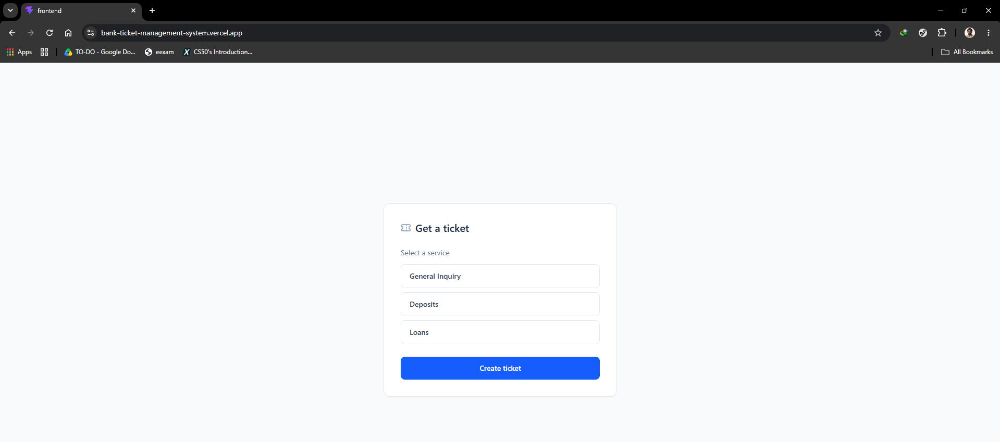
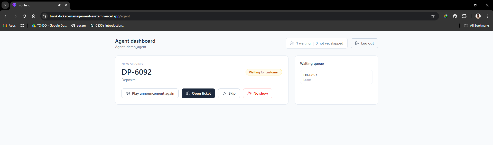
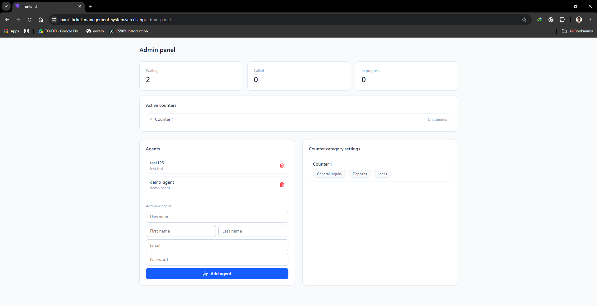

# Bank Ticket Management System

This is a recreation of my second personal. It is a real time bank ticket queue mangement system, Django Channels and React. Customers generate a ticket for a service category, agents call and serve tickets from a live queue, and admins get a real-time floor overview with staff and counter management.

The live demo can be accessed on this link: https://bank-ticket-management-system.vercel.app

Currently the backend is hosted on Render's free tier for demo purposes, which becomes idle after some inactivity. The first request after idle can take 50-60 seconds to wake up. 

A real-time queue management system for banks, built with Django Channels and React. Customers generate a ticket for a service category, agents call and serve tickets from a live queue, and admins get a real-time floor overview with staff and counter management.

This app is build using React (vite) and Tailwind for frontend and in backend we have python, Django, Redis, Google Cloud Text-to-Speech and PostgreSQL.

## Demo credentials

The Admin Panel (`/admin-panel`) requires no login by design.

To try the Agent Dashboard (`/agent`), use:

```
Username: demo_agent
Password: demo1234
```

## Screenshots

Ticket Generation Page:



Agent Dashboard Page:



Admin Panel Page:



## How to run locally

### Requirements
- Python 3.13+, Node.js, Docker Desktop

### Backend + database + Redis (via Docker)

docker compose up --build

Create a superuser:

docker compose exec backend python manage.py createsuperuser

Then set that user's **Role** to `Admin` in `/admin`, and add at least one Category and Counter.

### Frontend

cd frontend
npm install
npm run dev

Copy `.env.example` to `.env` and fill in your own values:

The app runs at `http://localhost:5173`.

### Google Cloud Text-to-Speech

The announcement feature calls a real Google Cloud TTS backend endpoint. To use it locally, place a Google Cloud service account key at `backend/secrets/bank-ticket-system-679961a25212.json`. Without it, the announcement request will fail, but the rest of the app should work normally.

## limitations

- Every agent is currently assigned to a single hardcoded counter. A real multi-counter deployment would need agents to select or be assigned a counter on login.
- The Admin Panel has no login gate by design.
